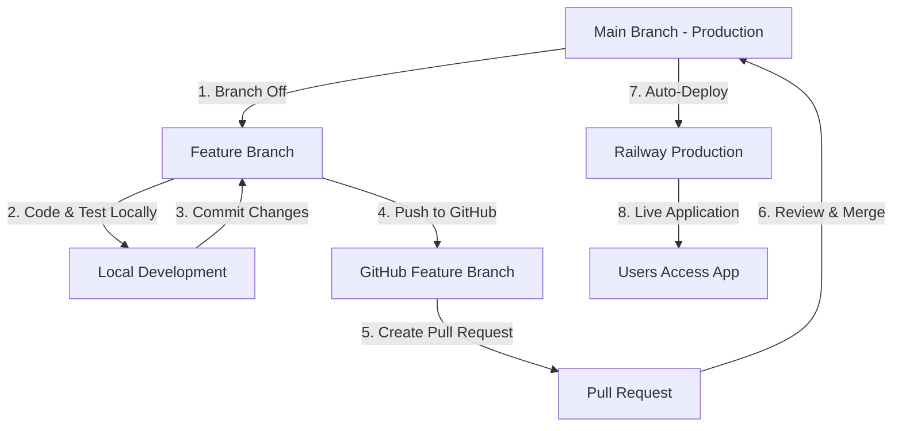

# Complete Development & Deployment Workflow Guide

This comprehensive guide covers everything you need to know about developing, managing, and deploying your Inventory Management System (Spring Boot + Angular + PostgreSQL).

## Table of Contents

1. [Understanding Environment Configurations](#1-understanding-environment-configurations)
2. [Local Development Setup](#2-local-development-setup)
3. [Git Workflow & Branch Strategy](#3-git-workflow--branch-strategy)
4. [Development Workflow](#4-development-workflow)
5. [Production Deployment](#5-production-deployment)
6. [Best Practices & Guidelines](#6-best-practices--guidelines)
7. [Troubleshooting](#7-troubleshooting)

---

## 1. Understanding Environment Configurations

### 1.1 Frontend (Angular) - Environment Files

The Angular application uses three environment files located in `frontend/src/environments/`:

```
frontend/src/environments/
├── environment.ts              ← Base file (your code imports this)
├── environment.development.ts  ← Local development config
└── environment.prod.ts        ← Production (Railway) config
```

#### How It Works

**Your TypeScript code always imports:**
```typescript
import { environment } from './environments/environment';
```

**Angular's build system automatically replaces the file:**

| Command | File Used | Purpose |
|---------|-----------|---------|
| `npm start` | `environment.development.ts` | Local development |
| `npm run build --configuration production` | `environment.prod.ts` | Production build (Railway) |
| `ng build` (no config) | `environment.ts` | Fallback |

#### File Contents

**environment.development.ts** (Local):
```typescript
export const environment = {
  production: false,
  apiUrl: 'http://localhost:8080'
};
```

**environment.prod.ts** (Production):
```typescript
export const environment = {
  production: true,
  apiUrl: 'API_URL_PLACEHOLDER'  // Replaced by Dockerfile with actual Railway backend URL
};
```

**environment.ts** (Fallback):
```typescript
export const environment = {
  production: false,
  apiUrl: 'http://localhost:8080'  // Safe default
};
```

#### Why Three Files?

- **environment.ts**: Safety net/fallback if build configuration fails
- **environment.development.ts**: Your daily local development config (used by `npm start`)
- **environment.prod.ts**: Production config (used by Railway builds)

**Important:** All three files should be committed to Git. They don't contain secrets.

---

### 1.2 Backend (Spring Boot) - Configuration Files

The Spring Boot application uses profile-based configuration located in `backend/src/main/resources/`:

```
backend/src/main/resources/
├── application.properties      ← Production (Railway)
└── application-dev.properties  ← Local development
```

#### How It Works

Spring Boot selects configuration based on the active profile:

| Profile | File Used | How to Activate |
|---------|-----------|----------------|
| `dev` | `application-dev.properties` | Set `SPRING_PROFILES_ACTIVE=dev` |
| None (default) | `application.properties` | No profile set (Railway default) |

#### File Contents

**application-dev.properties** (Local):
```properties
server.port=8080
spring.datasource.url=jdbc:postgresql://localhost:5432/finaldb
spring.datasource.username=postgres
spring.datasource.password=123456
spring.jpa.hibernate.ddl-auto=update
cors.allowed.origins=http://localhost:4200
```

**application.properties** (Production):
```properties
server.port=${PORT:8080}
spring.datasource.url=${SPRING_DATASOURCE_URL}
spring.datasource.username=${SPRING_DATASOURCE_USERNAME}
spring.datasource.password=${SPRING_DATASOURCE_PASSWORD}
spring.jpa.hibernate.ddl-auto=update
cors.allowed.origins=${CORS_ALLOWED_ORIGINS:http://localhost:4200}
```

#### Key Differences

- **Local**: Hardcoded localhost values in `application-dev.properties`
- **Production**: Uses environment variables (provided by Railway) in `application.properties`

**Important:** Both files should be committed to Git. Secrets are provided via Railway environment variables, not hardcoded.

---

### 1.3 Environment Comparison Summary

| Aspect | Local Development | Production (Railway) |
|--------|------------------|---------------------|
| **Frontend Config** | `environment.development.ts` | `environment.prod.ts` |
| **Backend Config** | `application-dev.properties` | `application.properties` |
| **Database** | Local PostgreSQL (`localhost:5432/finaldb`) | Railway PostgreSQL |
| **Backend URL** | `http://localhost:8080` | `https://backend-production.up.railway.app` |
| **Frontend URL** | `http://localhost:4200` (dev server) | `https://frontend-production.up.railway.app` (nginx) |
| **CORS Origins** | `http://localhost:4200` | Railway frontend URL |
| **Port (Backend)** | `8080` | `8080` (from Railway `$PORT`) |
| **Port (Frontend)** | `4200` | `8080` (nginx) |

---

## 2. Local Development Setup

### 2.1 Prerequisites

**Backend:**
- Java 21 (JDK)
- Maven 3.9+
- PostgreSQL installed and running
- Database created: `finaldb`
- PostgreSQL credentials (default: `postgres` / `123456`)

**Frontend:**
- Node.js 18+
- npm (comes with Node.js)
- Angular CLI: `npm install -g @angular/cli`

### 2.2 Running the Application Locally

#### Step 1: Start PostgreSQL

Ensure PostgreSQL is running on `localhost:5432` with database `finaldb` created.

```sql
-- Create database if not exists
CREATE DATABASE finaldb;
```

#### Step 2: Start Backend

Open Terminal 1:

```bash
cd backend

# PowerShell
$env:SPRING_PROFILES_ACTIVE="dev"; mvn spring-boot:run

# CMD
set SPRING_PROFILES_ACTIVE=dev && mvn spring-boot:run

# Linux/Mac
SPRING_PROFILES_ACTIVE=dev mvn spring-boot:run
```

**Or using an IDE:**
- **IntelliJ IDEA**: Edit Run Configuration → Active profiles: `dev`
- **VS Code**: Add to launch.json: `"SPRING_PROFILES_ACTIVE": "dev"`

Backend starts on: `http://localhost:8080`

#### Step 3: Start Frontend

Open Terminal 2:

```bash
cd frontend
npm install  # First time only
npm start
```

Frontend starts on: `http://localhost:4200`

#### Step 4: Access the Application

Open browser: `http://localhost:4200`

### 2.3 Local Development Flow

```
┌──────────────────────────────────────────────────────────┐
│                  Local Development                        │
├──────────────────────────────────────────────────────────┤
│                                                           │
│  Browser                 Frontend              Backend   │
│    │                        │                     │      │
│    │←─── localhost:4200 ───┤                     │      │
│    │                        │                     │      │
│    │                        │← API calls →        │      │
│    │                        │                     │      │
│    │                   (ng serve)          (Spring Boot) │
│    │                        │                     │      │
│    │                   environment.dev.ts    app-dev.props│
│    │                   apiUrl: localhost:8080     │      │
│    │                        │                     │      │
│    │                        │                     ▼      │
│    │                        │            PostgreSQL       │
│    │                        │            localhost:5432   │
│    │                        │            database: finaldb│
└──────────────────────────────────────────────────────────┘
```

---

## 3. Git Workflow & Branch Strategy

### 3.1 Branch Strategy Overview

#### Recommended Approach (Feature Branch Workflow)

```
main (Production)
  │
  │◄──── feature/add-search
  │
  │◄──── bugfix/cors-issue
  │
  │◄──── hotfix/login-error
```

**Main Branch:**
- `main` (or `master`) - Production-ready code
- Deployed automatically to Railway
- **NEVER push directly to main**

**Supporting Branches:**
- `feature/*` - For new features (e.g., `feature/user-authentication`)
- `bugfix/*` - For bug fixes (e.g., `bugfix/cors-issue`)
- `hotfix/*` - For urgent production fixes (e.g., `hotfix/critical-security-patch`)

#### Optional: Two-Branch Strategy (More Advanced)

```
main (Production) ◄──── develop (Integration)
                           │
                           │◄──── feature/add-search
                           │
                           │◄──── bugfix/cors-issue
```

**Branches:**
- `main` - Production (Railway deploys from here)
- `develop` - Integration branch for testing features before production
- `feature/*`, `bugfix/*`, `hotfix/*` - Same as above

For solo development, the simpler Feature Branch Workflow (first option) is recommended.

---

### 3.2 The Golden Rule

**🛑 NEVER push directly to the `main` branch.**

Treat `main` as your "Production" code. It should always be stable and deployable.

---

### 3.3 Daily Git Workflow

#### Phase 1: Starting a New Feature

Before writing code, ensure you're starting from the latest version:

```bash
# 1. Switch to main and sync
git checkout main
git pull origin main

# 2. Create a feature branch
git checkout -b feature/add-employee-search
```

**Branch naming conventions:**
- `feature/description` - New features
- `bugfix/description` - Bug fixes
- `hotfix/description` - Urgent production fixes

You're now in a safe sandbox. Changes here won't affect production.

---

#### Phase 2: Development & Local Testing

Work on your code using the local development setup:

```bash
# Backend (Terminal 1)
cd backend
$env:SPRING_PROFILES_ACTIVE="dev"; mvn spring-boot:run

# Frontend (Terminal 2)
cd frontend
npm start
```

**Test your changes** at `http://localhost:4200`

**Commit often** with meaningful messages:

```bash
git add .
git commit -m "Add search filter to employee service"

# Continue working...
git add .
git commit -m "Add frontend search component"
```

---

#### Phase 3: Pushing & Creating Pull Request

Once your feature works perfectly locally:

**1. Push the branch:**
```bash
git push -u origin feature/add-employee-search
```

**2. Create a Pull Request (PR) on GitHub:**
- Go to your repository on GitHub
- You'll see a "Compare & pull request" button - click it
- Review your changes
- Write a meaningful PR description
- Click **"Create Pull Request"**

**3. Review and Merge:**
- If working solo, review your own code
- Click **"Merge pull request"** → **"Confirm merge"**
- Delete the branch on GitHub after merging (optional but recommended)

---

#### Phase 4: Deployment to Railway

**1. Railway Automation:**
- Railway watches your `main` branch
- As soon as you merge the PR, Railway detects the new commit
- It automatically pulls code, builds Docker images, and deploys

**2. Verify Deployment:**
- Check Railway dashboard for deployment status
- Test your production site

**3. Cleanup Locally:**
```bash
# Switch back to main
git checkout main

# Pull the merged changes
git pull origin main

# Delete the feature branch locally
git branch -d feature/add-employee-search
```

---

### 3.4 Handling Hotfixes (Emergency Bugs in Production)

If production is broken, don't wait for a feature to finish:

```bash
# 1. Switch to main and sync
git checkout main
git pull origin main

# 2. Create a hotfix branch
git checkout -b hotfix/login-error

# 3. Fix the bug
# ... make your changes ...

# 4. Test locally
# ... verify the fix works ...

# 5. Commit and push
git add .
git commit -m "Fix critical login error"
git push -u origin hotfix/login-error

# 6. Create PR and merge immediately
# (Use GitHub UI)

# 7. Cleanup
git checkout main
git pull origin main
git branch -d hotfix/login-error
```

---

### 3.5 Git Best Practices

#### Good Commit Messages

✅ **Good:**
```
Add user authentication feature
Fix CORS error on login endpoint
Update database schema for inventory table
Refactor employee service for better performance
```

❌ **Bad:**
```
fix
update
changes
asdfgh
wip
```

#### Before Merging to Main

Checklist:
- [ ] All features tested locally
- [ ] No errors in browser console
- [ ] Backend starts without errors
- [ ] Frontend builds successfully (`npm run build`)
- [ ] Database migrations tested (if any)
- [ ] Code is reviewed (self-review at minimum)

#### When to Merge to Main

✅ **DO merge when:**
- Feature is complete and tested
- No breaking changes
- All tests pass
- Code has been reviewed

❌ **DON'T merge when:**
- Feature is incomplete (work in progress)
- Code has untested changes
- Known bugs exist

---

### 3.6 Quick Git Reference

| Task | Command |
|------|---------|
| Start new feature | `git checkout -b feature/name` |
| Commit changes | `git add . && git commit -m "message"` |
| Push feature | `git push -u origin feature/name` |
| Switch to main | `git checkout main` |
| Pull latest changes | `git pull origin main` |
| See current branch | `git branch` |
| See all branches | `git branch -a` |
| Delete local branch | `git branch -d feature/name` |
| View commit history | `git log --oneline` |

---

### 3.7 Handling Git Conflicts

**If you have uncommitted changes when switching branches:**

```bash
# Save your work temporarily
git stash

# Switch branch
git checkout main

# Apply your saved work
git stash pop
```

**If you get merge conflicts:**

```bash
# 1. Git will show conflicting files
# 2. Open the files and resolve conflicts (look for <<<<<<, ======, >>>>>>)
# 3. After resolving:
git add .
git commit -m "Resolve merge conflicts"
git push
```

---

## 4. Development Workflow

### 4.1 The Complete Workflow (Visual Overview)



### 4.2 Step-by-Step Development Process

#### Step 1: Sync with Main
```bash
git checkout main
git pull origin main
```

#### Step 2: Create Feature Branch
```bash
git checkout -b feature/add-dark-mode
```

#### Step 3: Develop Locally

**Backend changes:**
- Edit files in `backend/src/`
- Configuration in `application-dev.properties` (local)
- Run with dev profile: `SPRING_PROFILES_ACTIVE=dev mvn spring-boot:run`

**Frontend changes:**
- Edit files in `frontend/src/`
- Configuration in `environment.development.ts` (local)
- Run with: `npm start`

**Test at:** `http://localhost:4200`

#### Step 4: Commit Frequently
```bash
git add .
git commit -m "Add dark mode toggle component"

# Continue working...
git add .
git commit -m "Add dark mode styles"
```

#### Step 5: Push and Create PR
```bash
git push -u origin feature/add-dark-mode
# Then create PR on GitHub
```

#### Step 6: Merge and Deploy
- Merge PR on GitHub
- Railway automatically deploys to production

#### Step 7: Cleanup
```bash
git checkout main
git pull origin main
git branch -d feature/add-dark-mode
```

---

### 4.3 Managing Environments

You don't need to change code to switch environments - everything is handled by build configurations and environment variables.

#### Local Environment

**What gets used:**
- Frontend: `environment.development.ts` (via `npm start`)
- Backend: `application-dev.properties` (via `SPRING_PROFILES_ACTIVE=dev`)
    - *Command: `mvn spring-boot:run "-Dspring-boot.run.profiles=dev"`*
- Database: Local PostgreSQL at `localhost:5432/finaldb`

**How to run:**
```bash
# Backend
cd backend
$env:SPRING_PROFILES_ACTIVE="dev"; mvn spring-boot:run

# Frontend
cd frontend
npm start
```

#### Production Environment (Railway)

**What gets used:**
- Frontend: `environment.prod.ts` (via `npm run build --configuration production`)
- Backend: `application.properties` (with Railway environment variables)
- Database: Railway PostgreSQL

**How it runs:**
- Automatically on `git push` to `main`
- Railway builds using Dockerfiles
- Environment variables set in Railway dashboard

---

## 5. Production Deployment

### 5.1 Railway Auto-Deployment

Railway is configured to automatically deploy when you push to the `main` branch.

**Process:**
1. You merge a PR into `main`
2. Railway detects the new commit
3. Railway pulls the latest code
4. Railway builds Docker images (backend and frontend separately)
5. Railway deploys the new version
6. Your application is live

### 5.2 Railway Environment Variables

**Backend Service (Required):**
| Variable | Value | Purpose |
|----------|-------|---------|
| `PORT` | `8080` | Port for Spring Boot |
| `SPRING_DATASOURCE_URL` | `jdbc:postgresql://${{Postgres.PGHOST}}:${{Postgres.PGPORT}}/${{Postgres.PGDATABASE}}` | Database connection |
| `SPRING_DATASOURCE_USERNAME` | `${{Postgres.PGUSER}}` | Database username |
| `SPRING_DATASOURCE_PASSWORD` | `${{Postgres.PGPASSWORD}}` | Database password |
| `CORS_ALLOWED_ORIGINS` | `http://localhost:4200,https://your-frontend.up.railway.app` | Allowed origins for CORS |

**Frontend Service (Required):**
| Variable | Value | Purpose |
|----------|-------|---------|
| `PORT` | `8080` | Port for nginx |
| `API_URL` | `https://your-backend.up.railway.app` | Backend API URL |

### 5.3 Verifying Deployment

1. **Check Railway Dashboard:**
   - View deployment logs
   - Check service status (should show "Active")

2. **Test Production Application:**
   - Visit your frontend URL
   - Try registering a user
   - Verify functionality works

3. **Common Deployment Checks:**
   - [ ] Both services show "Active" status
   - [ ] No errors in deployment logs
   - [ ] Environment variables are set correctly
   - [ ] Frontend can reach backend (no CORS errors)
   - [ ] Database connection works

---

## 6. Best Practices & Guidelines

### 6.1 Code Management

**DO:**
- ✅ Always work on feature branches
- ✅ Test locally before pushing
- ✅ Write meaningful commit messages
- ✅ Keep commits focused (one feature/fix per commit)
- ✅ Review your own code before merging

**DON'T:**
- ❌ Push directly to `main`
- ❌ Commit untested code
- ❌ Merge incomplete features
- ❌ Commit sensitive data (passwords, API keys)
- ❌ Use vague commit messages ("fix", "update")

### 6.2 Environment Configuration

**DO:**
- ✅ Commit all environment files (they don't contain secrets)
- ✅ Use environment variables for production secrets
- ✅ Test with dev profile locally (`SPRING_PROFILES_ACTIVE=dev`)
- ✅ Keep local and production configs separate

**DON'T:**
- ❌ Put real secrets in committed files
- ❌ Delete any environment files
- ❌ Try to use production build locally
- ❌ Hardcode production credentials

### 6.3 File Commit Guide

**Files to ALWAYS commit:**
- ✅ All `environment*.ts` files (frontend)
- ✅ All `application*.properties` files (backend)
- ✅ Source code (`*.java`, `*.ts`, `*.html`, `*.css`)
- ✅ Configuration files (`pom.xml`, `package.json`, `angular.json`)
- ✅ Dockerfiles

**Files to NEVER commit (.gitignore):**
- ❌ `node_modules/` - Frontend dependencies
- ❌ `target/` - Backend build output
- ❌ `dist/` - Frontend build output
- ❌ `.env` - Local environment secrets
- ❌ `.idea/`, `.vscode/` - IDE configurations
- ❌ `*.log` - Log files

### 6.4 Database Management

**Local Development:**
- Use local PostgreSQL database (`finaldb`)
- Safe to reset/modify during development
- Configured in `application-dev.properties`

**Production (Railway):**
- Railway PostgreSQL service
- Data persists across deployments
- **NEVER** run destructive operations without backup

### 6.5 Summary Checklist

Before pushing to production, verify:

- [ ] Am I on a feature branch? (NOT `main`)
- [ ] Did I test locally with dev profile?
- [ ] Did I commit all my changes?
- [ ] Did I write meaningful commit messages?
- [ ] Is my feature complete and working?
- [ ] Did I create a PR (not push directly to main)?
- [ ] Did I review my code changes?
- [ ] Will this deploy to Railway after merge?

---

## 7. Troubleshooting

### 7.1 Local Development Issues

#### Backend Won't Start

**Error:** "URL must start with 'jdbc'"
```
Solution:
- Ensure you're running with dev profile
- Command: $env:SPRING_PROFILES_ACTIVE="dev"; mvn spring-boot:run
- Verify application-dev.properties exists and has correct database URL
```

**Error:** "Could not connect to database"
```
Solution:
- Check PostgreSQL is running: Open pgAdmin or run `psql -U postgres`
- Verify database 'finaldb' exists
- Check credentials in application-dev.properties match your PostgreSQL setup
```

**Error:** Port 8080 already in use
```
Solution:
- Check if another instance is running
- Stop the other instance or change port in application-dev.properties
```

#### Frontend Issues

**Error:** "Cannot connect to backend" or CORS error
```
Solution:
- Ensure backend is running on http://localhost:8080
- Check environment.development.ts has: apiUrl: 'http://localhost:8080'
- Verify CORS in application-dev.properties: cors.allowed.origins=http://localhost:4200
```

**Error:** npm start fails
```
Solution:
- Delete node_modules: rm -rf node_modules
- Clear npm cache: npm cache clean --force
- Reinstall: npm install
```

**Error:** Port 4200 already in use
```
Solution:
- Kill existing process: npx kill-port 4200
- Or run on different port: ng serve --port 4300
```

### 7.2 Git Issues

**Error:** "Your branch is behind origin/main"
```bash
# Pull latest changes
git pull origin main

# If you have local changes:
git stash
git pull origin main
git stash pop
```

**Error:** Merge conflict
```bash
# 1. Open conflicting files
# 2. Look for <<<<<<, ======, >>>>>> markers
# 3. Resolve conflicts manually
# 4. After resolving:
git add .
git commit -m "Resolve merge conflicts"
```

**Error:** Committed to main by accident
```bash
# If you haven't pushed yet:
git reset HEAD~1  # Undo last commit, keep changes

# If you already pushed (use carefully!):
git revert HEAD
git push origin main
```

### 7.3 Railway Production Issues

#### Build Failures

**Check deployment logs in Railway:**
- Go to service → Deployments → Click on failed deployment
- Read error messages

**Common causes:**
- Missing environment variables
- Invalid `pom.xml` or `package.json`
- Wrong root directory (`/backend` or `/frontend`)
- Dockerfile errors

#### CORS Errors in Production

**Error:** "Access-Control-Allow-Origin" error

```
Solution:
1. Check CORS_ALLOWED_ORIGINS in Railway backend service
2. Should be: http://localhost:4200,https://your-frontend.up.railway.app
3. No spaces between comma-separated origins
4. After updating, Railway will auto-redeploy
```

#### 502 Bad Gateway

**Possible causes:**
- Port not set to 8080 for both services
- Backend not starting (check logs)
- Nginx misconfigured (check frontend/nginx.conf)

**Solution:**
```
1. Verify PORT=8080 set for both frontend and backend in Railway
2. Check backend deployment logs for startup errors
3. Verify nginx.conf listens on port 8080
```

#### Database Connection Error

**Error:** Backend can't connect to database

```
Solution:
1. Verify SPRING_DATASOURCE_URL format: jdbc:postgresql://...
2. Check all variables: PGHOST, PGUSER, PGPASSWORD, PGDATABASE
3. Use Railway's variable reference syntax: ${{Postgres.PGHOST}}
4. Ensure PostgreSQL service is running in Railway
```

### 7.4 Environment File Issues

**Problem:** "Frontend uses old API URL locally"
```
Solution:
- Check environment.development.ts (NOT environment.ts)
- Restart npm start after changes
```

**Problem:** "Production uses localhost API"
```
Solution:
- Verify Railway environment variable API_URL is set
- Check environment.prod.ts has API_URL_PLACEHOLDER
- Verify Dockerfile replaces placeholder correctly
```

**Problem:** "Backend uses wrong database locally"
```
Solution:
- Ensure SPRING_PROFILES_ACTIVE=dev is set
- Check application-dev.properties has correct local database URL
```

### 7.5 Emergency: Rollback Production

If you deployed something broken to production:

```bash
# 1. View commit history
git log --oneline

# 2. Find the last good commit hash (e.g., abc1234)

# 3. Revert to that commit
git checkout main
git revert HEAD  # Creates a new commit that undoes the last one

# Or for hard reset (use carefully!):
git reset --hard abc1234
git push -f origin main  # Force push (emergency only!)
```

**Note:** Force push should only be used in emergencies. Prefer `git revert` for safer rollbacks.

---

## Quick Reference Card

### Local Development Commands

```bash
# Start Backend (dev profile)
cd backend
$env:SPRING_PROFILES_ACTIVE="dev"; mvn spring-boot:run

# Start Frontend
cd frontend
npm start

# Access Application
# Frontend: http://localhost:4200
# Backend: http://localhost:8080
# Database: localhost:5432/finaldb
```

### Git Workflow Commands

```bash
# Start new feature
git checkout main
git pull origin main
git checkout -b feature/feature-name

# Commit changes
git add .
git commit -m "Descriptive message"

# Push and create PR
git push -u origin feature/feature-name
# Then create PR on GitHub

# After merge, cleanup
git checkout main
git pull origin main
git branch -d feature/feature-name
```

### Environment Files Quick Check

| File | Used When | Contains |
|------|-----------|----------|
| `environment.development.ts` | Local `npm start` | localhost:8080 |
| `environment.prod.ts` | Railway build | API_URL_PLACEHOLDER |
| `application-dev.properties` | Local dev profile | localhost:5432/finaldb |
| `application.properties` | Railway (no profile) | ${SPRING_DATASOURCE_URL} |

---

## Summary

This guide covers:

✅ **Environment Configurations**: How frontend and backend configs work for local vs production
✅ **Local Development**: Running the application on your machine
✅ **Git Workflow**: Feature branch workflow and best practices
✅ **Development Process**: Step-by-step guide from code to deployment
✅ **Production Deployment**: How Railway auto-deploys from main
✅ **Best Practices**: DOs and DON'Ts for code management
✅ **Troubleshooting**: Solutions to common problems

**Remember the Golden Rule:** Never push directly to `main`. Always use feature branches and pull requests.

Your development flow:
1. Create feature branch
2. Code and test locally
3. Commit and push
4. Create PR and merge
5. Railway auto-deploys to production

Happy coding! 🚀
